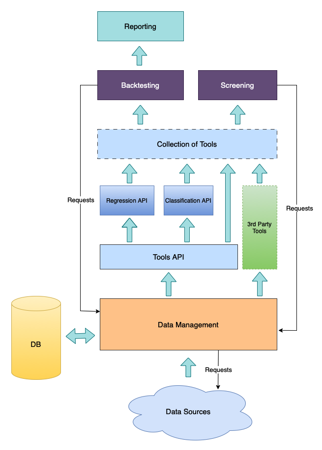
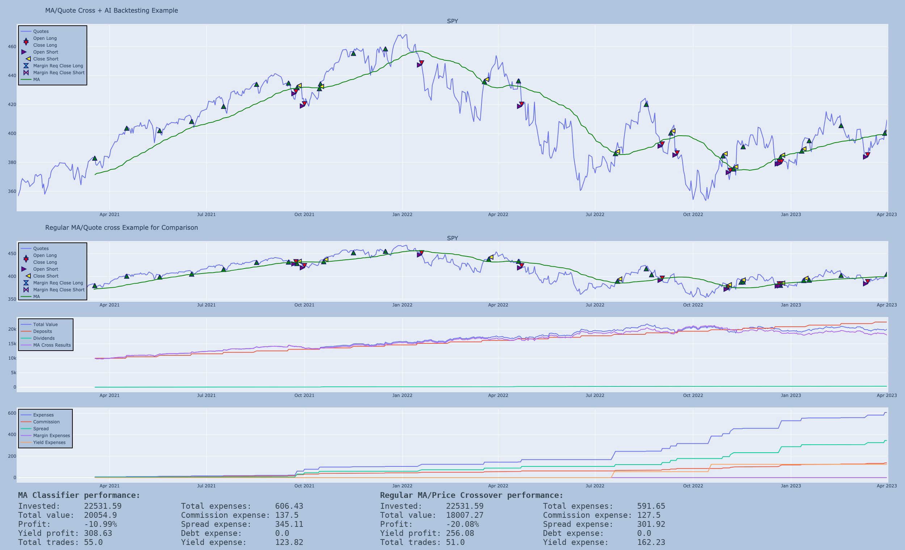

# Fcore Is an AI Framework for Financial Markets Analysis.

### With the help of it, you can easily perform the following actions:

- Obtain data from various sources (AlphaVantage, Polygon, Yahoo Finance, Finnhub) and store it in an unified way.
- Use an API to ease the development of AI-strategies for financial markets analysis.
- Utilize the power of the 'classical' technical and fundamental analyses combined with the modern AI-approach.
- Use the own backtesting engine which takes into account a lot of expenses related to an actual trade/investment and supports strategies involving multiple securities.
- Perform a real-time screening of the market using the screening API.
- Generate reports.

### Here is a simplified diagram of how Fcore is designed:



# Quick Start

Here are some basic examples of how to use Fcore.

**The latest version of yfinance library is required to run these examples. Always update yfinace to the latest version using 'pip install yfinance --upgrade'**

## Data Management

The first one is a basic data management example which shows how to use the framework with the popular data sources. Invoke **python -m quickstart.min_data_management** to run the example.

```python
# Edit settings.py to add your API keys for data sources. Free API keys are sufficient for this example.
from data import av, fh, yf, polygon  # API wrappers for popular data sources (please note that they are unofficial)
from data.fvalues import Timespans
from data.fdata import Subquery
from data.stock import report_year  # Condition to request annual report.

from datetime import datetime, timedelta

# Fetch quotes if needed. Otherwise just take them from a database.
# Contigious interval of quotes will be preserved in the database.
yf.YF(symbol='SPY', first_date="2017-1-1", last_date="2018-1-1").get()
yf.YF(symbol='SPY', first_date="2020-1-1", last_date="2021-1-1", verbosity=True).get()

# Fetch last week of minute SPY quotes from Polygon
now = datetime.now()
then = datetime.now() - timedelta(days=7)
pvi = polygon.Polygon(symbol='SPY', first_date=then, last_date=now, timespan=Timespans.Minute)

p_quotes = pvi.get_quotes_only()

print(f"Total quotes num for 'SPY': {len(p_quotes)}")

print("Fetch daily quotes, dividend and split data for 'IBM' from AV/YF...")

avi = av.AVStock(symbol='IBM')
avi.get_quotes_only()  # Do not get dividends and splits

yfi = yf.YF(symbol='IBM')
yfi.get_dividends()
yfi.get_splits()

print(f"Fetch fundamental data for {'IBM'} from AV...")

# Fetch fundamental data and add it to DB
avi.get_earnings()
avi.get_cash_flow()
avi.get_balance_sheet()
avi.get_income_statement()

print("Get quotes from DB along with some fundamental data")
avi.db_connect()
rows = avi.get_quotes(queries=[Subquery('earnings', 'reported_date'),  # It will get both quarterly and annual reports
                               Subquery('earnings', 'reported_eps'),
                               Subquery('cash_flow', 'operating_cashflow', condition=report_year, title='annual_cashflow')])
avi.db_close()

# Print last rows of requested data
print(f"\nThe last row of obtained quotes and fundamental data for 'IBM':\n{rows[-1]}")

# Get the latest quote from Finnhub for AAPL (responce described in fvalues.Quotes)
aapl_data = fh.FHStock(symbol='AAPL').get_recent_data()

print(f"\nRecent quote data for 'AAPL': {aapl_data}")
```

## Growth Probability Estimation

This is another example of how to create your own basic growth probability estimation. This tiny script manages the data, creates a tool for security growth estimation and displays the result as a chart. Invoke **python -m quickstart.min_growth_probability** to run the example.

```python
from tools.classifier import Classifier

from data.fvalues import StockQuotes, Algorithm
from data.yf import YF
from data.futils import update_layout, show_image

import pandas as pd
import pandas_ta as ta

import plotly.graph_objects as go
from plotly.subplots import make_subplots

class Probability(Classifier):
    """Minimalistic growth probability impementation."""
    def __init__(self, period_long=30, period_short=15, **kwargs):
        """Initializes minimalistic grows probability instance."""
        super().__init__(**kwargs)

        self._period_long = period_long  # Long SMA period for growth estimation.
        self._period_short = period_short  # Short SMA period for growth estimation.

        self._probability = True  # Calculate probabilities in the tool
        self._classify = False  # No need to perform classification
        self._use_sell = False  # Sell signals are not used by this tool

    def prepare(self, rows=None):
        """Prepare the DataFrame for learning/estimation."""
        df = pd.DataFrame(self._rows) if rows is None else pd.DataFrame(rows)  # Create the dataframe base on provided data

        # Calculate required technical indicators
        ma_long = ta.sma(df[StockQuotes.AdjClose], length = self._period_long)  # Long SMA
        ma_short = ta.sma(df[StockQuotes.AdjClose], length = self._period_short)  # Short SMA
        pvo = ta.pvo(df[StockQuotes.Volume])  # Percentage volume oscillator

        # Prepare data for learning/estimation
        df['pvo'] = pvo.iloc[:, 0]
        df['ma-long'] = ma_long
        df['ma-short'] = ma_short
        df['quote'] = df[StockQuotes.AdjClose]
        df['ma-diff'] = ((ma_long - ma_short) / ma_long)  # Ratio of difference between long and short SMAs
        df['hilo-diff'] = ((df[StockQuotes.High] - df[StockQuotes.Low]) / df[StockQuotes.High])  # Ratio of difference between High and Low

        self._data_to_est = ['pvo', 'ma-diff', 'hilo-diff']  # Columns to learn/estimate
        self._data_to_report = self._data_to_est + ['ma-long', 'ma-short', 'quote']  # Columns for reporting

        # Get rid of the values where MA is not calculated because they are useless for learning.
        return df[self._period_long-1:].reset_index().drop(['index'], axis=1)

    def get_buy_condition(self, df):
        """Get buy condiiton to check signals."""
        curr_quote = df[StockQuotes.AdjClose]
        next_quote = df[StockQuotes.AdjClose].shift(-abs(self._cycle_num))

        return (next_quote - curr_quote) / curr_quote >= self._true_ratio

###############
# Demonstration
###############

period_long, period_short = (50, 25)  # Periods for SMAs

# Get data for training/testing a model. It will be cached in a database without the need of further fetching
rows_learn = YF(symbol='SPY', first_date="2000-1-1", last_date="2021-1-1").get()
rows_test = YF(symbol='SPY', first_date="2021-1-2", last_date="2023-4-1").get()

prob = Probability(period_long=period_long,
                   period_short=period_short,
                   rows=rows_test,
                   data_to_learn=[rows_learn],
                   true_ratio=0.004,  # Ratio when signal is considered as true in cycle_num.
                                      # For example, if true_ratio is 0.03 and cycle_num is 5,
                                      # then the signal will be considered as true if there was a 3% change in
                                      # quote in the following 5 cycles after getting the signal.
                   cycle_num=2,  # Nuber of cycles to reach true_ratio to consider the signal as true.
                   algorithm=Algorithm.KNC)

prob.learn()
prob.calculate()
df = prob.get_results()

# Buind the report
fig = make_subplots(rows=2, cols=1, shared_xaxes=True, row_width=[0.3, 0.7],
                    specs=[[{"secondary_y": False}],
                            [{"secondary_y": False}]])

fig.add_trace(go.Scatter(x=df['dt'], y=df['quote'], name="AdjClose"), secondary_y=False)
fig.add_trace(go.Scatter(x=df['dt'], y=df['ma-long'], name="Long MA"), secondary_y=False)
fig.add_trace(go.Scatter(x=df['dt'], y=df['ma-short'], name="Short MA"), secondary_y=False)

# Add probabilities chart
fig.add_trace(go.Scatter(x=df['dt'], y=df['buy-prob'], fill='tozeroy', name="Growth Probability"), row=2, col=1)

update_layout(fig, "Probabilities Example Chart", len(rows_test))
show_image(fig)
```

The script will generate a chart with close price and moving averages and also a subchart with growth probabilities at corresponding moments of time:


## Backtesting and Classification of Technical Analysis Signals

Using market analysis API provided with Fcore you can easily classify nearly every event which happens on a market. This is an example of 'SMA vs Price' strategy when technical signals are distinguished by AI of being true/false. This example also performs a backtest to compare results with and without AI usage on the similar strategy. Invoke **python -m quickstart.min_ma_classification** to run the example.

```python
from data.fvalues import Algorithm
from tools.ma_classifier import MAClassifier

from backtest.ma_classification import MAClassification
from backtest.ma import MA
from backtest.stock import StockData
from backtest.reporting import Report

from data.yf import YF

import plotly.graph_objects as go

period = 50  # SMA period

min_width = 2500 # Minimum width for reporting
height = 250  # Height of each subchart in reporting

# Get data for training/testing. All the data will be cached in a database without the need of further fetching
rows_learn = YF(symbol='SPY', first_date="2000-1-1", last_date="2021-1-1").get()
rows_test = YF(symbol='SPY', first_date="2021-1-2", last_date="2023-4-1").get()

# Train the model
classifier = MAClassifier(period=period,  # SMA Period
                          data_to_learn=[rows_learn],  # Raw quote data to train the model
                          true_ratio=0.004,  # Ratio when signal is considered as true in cycle_num.
                                             # For example, if true_ratio is 0.03 and cycle_num is 5,
                                             # then the signal will be considered as true if there was a 3% change in
                                             # quote in the following 5 cycles after getting the signal.
                          cycle_num=2,  # Nuber of cycles to reach true_ratio to consider the signal as true.
                          algorithm=Algorithm.LDA)  # Classification algorithm to use.

classifier.learn()

# Perform the backtest

# Define backtesting parameters for SPY
quotes = StockData(rows=rows_test,  # Raw quote data
                   title='SPY',
                   spread=0.1,  # Expected spread
                   trend_change_period=2,  # Num of trade cycles (Days) when a stable trend is considered as changed
                   trend_change_percent=2  # Change in percent to consider the trend as changed immediately
                  )

# Parameters for backtesting
params = {
    'data': [quotes],
    'commission': 2.5,
    'initial_deposit': 10000,
    'periodic_deposit': 500,
    'deposit_interval': 30,
    'inflation': 2.5,
    'period': period,
    'margin_rec': 0.9,  # Use some margin (required and recommended) to test shorting.
    'margin_req': 1
}

# Perform backtest using AI classification of signals
classification = MAClassification(**params, classifier=classifier)

classification.calculate()  # It starts the calculation in a separate thread which allows you to make a parralel computations
                            # if you use a Pyhon interpreter without GIL.

# Regular strategy (without classifying signals) for comparison
ma = MA(**params)

ma.calculate()

results_cls = classification.get_results()  # Wait till calculation finishes and return the results.
results_cmp = ma.get_results()

# Generate a report with performance comparison
report = Report(data=results_cls, width=max(len(rows_test), min_width), margin=True)

fig_quotes = report.add_quotes_chart(title="MA/Quote Cross + AI Backtesting Example")
fig_quotes.add_trace(go.Scatter(x=results_cls.DateTime, y=results_cls.Symbols[0].Tech[0], mode='lines', name="MA", line=dict(color="green")))

fig_cmp = report.add_quotes_chart(title="Regular MA/Quote cross Example for Comparison", data=results_cmp, height=height)
fig_cmp.add_trace(go.Scatter(x=results_cmp.DateTime, y=results_cmp.Symbols[0].Tech[0], mode='lines', name="MA", line=dict(color="green")))

fig_portf = report.add_portfolio_chart(height=height)
fig_portf.add_trace(go.Scatter(x=results_cmp.DateTime, y=results_cmp.TotalValue, mode='lines', name="MA Cross Results"))

report.add_expenses_chart(height=height)

# Add annotations with strategy results
report.add_annotations(title="MA Classifier performance:")
report.add_annotations(data=results_cmp, title="Regular MA/Price Crossover performance:")

# Show image
report.show_image()
```

It is the report generated by the script above:


Here we see that AI helped to better distinguish signals of the strategy and decreased the loses.

# Other Examples

The examples above are only a little part of what Fcore is capable. The following examples illustrates the wider usage of the framework.

Use the following tools to manage quotes and obtain data.

- *Yahoo Finance* wrapper - [data/yf.py](data/yf.py))
- *Polygon.IO* API wrapper - [data/polygon.py](data/polygon.py))
- API wrapper for *Alpha Vantage* stock data - [data/av.py](data/av.py)
- API wrapper for *Finnhub* real time data - [data/fh.py](data/fh.py)

### Examples of custom data processing tools which are relied on AI
- [tools/regression.py](tools/regression.py) - Regression API implementation for financial analysis (**python -m demo.tools.regression_demo** for a demonstration using LSTM algorithm, [source of the demo](demo/tools/regression_demo.py) )
- [tools/ma_classifier.py](tools/ma_classifier.py) AI tool where MA/price crossover signals are determined by AI if they are true/false. (**python -m demo.tools.ma_classifier_demo** for demonstration, [source of the demo](demo/tools/ma_classifier_demo.py))
- [tools/growth_probability.py](tools/growth_probability.py) AI trend estimator based on probabilistic classification. (**python -m demo.tools.growth_probability_demo** for demonstration, [source of the demo](demo/tools/growth_probability_demo.py))

### Screening demos
- [screener/rsi_scr.py](screener/rsi_scr.py) - RSI strategy screener (**python -m demo.screening.rsi_scr_demo** for a demonstation, [source of the demo](demo/screening/rsi_scr_demo.py))
- [screener/regression_scr.py](screener/rsi_scr.py) - Regression AI screener (**python -m demo.screening.regression_scr_demo** for a demonstation, [source of the demo](demo/screening/regression_scr_demo.py))
- [screener/classification_scr.py](screener/classification_scr.py) - Classification AI screener (**python -m demo.screening.classification_scr_demo** for a demonstation, [source of the demo](demo/screening/classification_scr_demo.py))

### Examples of backtesting strategies
- [backtest/bh.py](backtest/bh.py) - Simple backtesting strategy with periodic investments adjusted to inflation (**python -m demo.backtest.bh_test**, [source of the demo](demo/backtest/bh_test.py))
- [backtest/ma.py](backtest/ma.py) - MA crossover strategy implementation (**python -m demo.backtest.ma_test**, [source of the demo](demo/backtest/ma_test.py))
- [backtest/rsi.py](backtest/rsi.py) - RSI stragegy multi-security demo. See **python -m demo.backtest.rsi_test** for an EOD test and **python demo.backtest.rsi_intraday_test** for an intraday demonstation. [Source of the EOD demo](demo/backtest/rsi_test.py), [source of the intraday demo](demo/backtest/rsi_intraday_test.py).
- [backtest/ma_classification.py](backtest/ma_classification.py) - MA/price crossower strategy where true/false signals are determined by AI. (**python -m demo.backtest.ma_classification_test**, [source of the demo](demo/backtest/ma_classification_test.py))

Note that the tools and backtesting demos create an image with the result of a calculation located in *images* folder and open the image in the default image viewer.

# Additional Details

To keep everything working, please keep all the dependencies up to date. Especially the dependencies which are related to data sources (like yfinance).

Currently Fcore is in the active development stage and is not promoted anywhere yet. However, if you found it and feel interested, sure you are welcome to observe the development process or contribute to the project. The 'general idea' of Fcore will remain the same but APIs still may change.

The repository uses two branches: 'main' and 'devel'. The 'main' branch is usually stable but as a verification process is not fully established yet, sometimes bugs may be committed there. The 'devel' branch is used for 'intermediate' development commits and it is not intended to be stable or even working. See TODO's (followed by priority) in the code for what is going to be implemented/fixed in the future.

All fetched quotes are cached in a database (sqlite by default). Data-related settings (like api-keys) are stored in [settings.py](settings.py) file.

**Fcore** is adopted to [nogil-3.9.10](https://github.com/colesbury/nogil) python interpreter. Use it with **nogil** to benefit from parallel computing (not fully stable).

Fcore is distributes on an 'AS IS' basis using a custom source available [License](license.md). The author is not responsible for any losses caused by using the project.

Please note that Fcore is a tool which helps you to easily implement and test your own financial strategies but it does not provide any 'out of the box' solutions. Consider all the provided demos as programming examples which help you to implement your own strategies.

In case of any questions, please feel free to contact me by email - zmiciergt at icloud dot com
